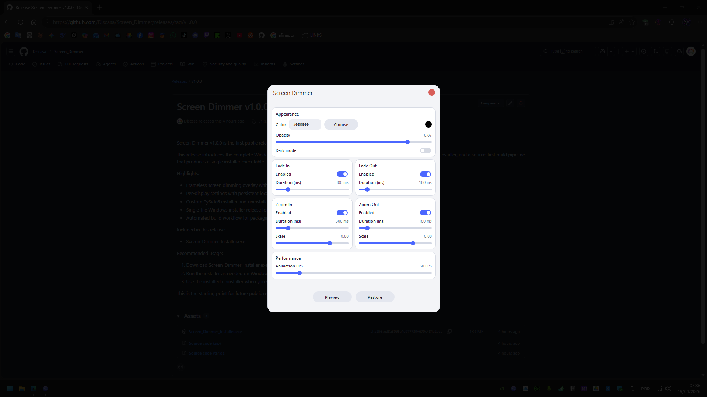
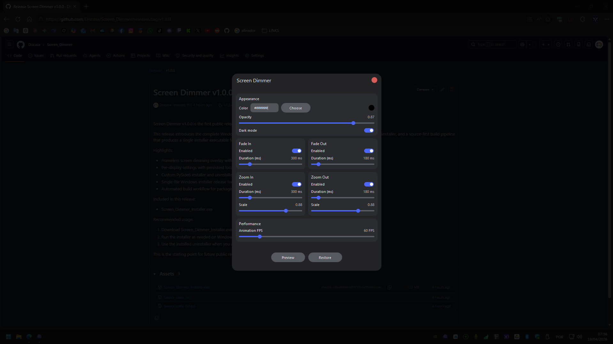
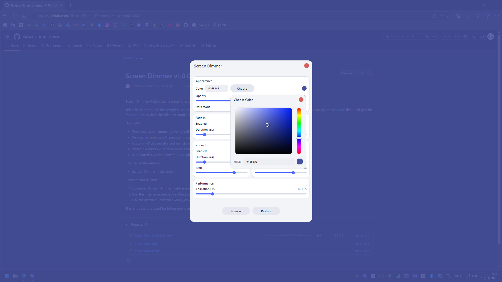
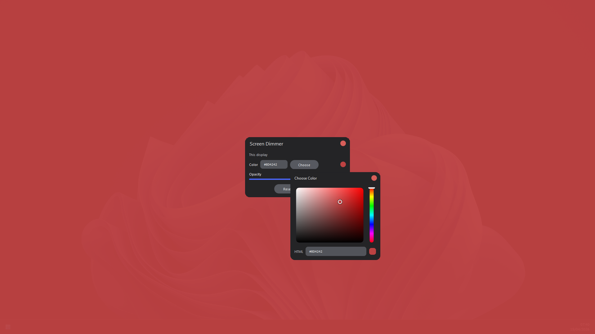

<h1>
  
  Screen Dimmer
</h1>

Screen Dimmer is a Windows desktop utility that places a frameless color overlay on each display so you can dim the screen with adjustable opacity, custom tint, and smooth configurable animations.

It includes light and dark themes, custom tint controls, and per-monitor profiles, so every screen can keep its own look and saved settings.

  
  

  
  

For the full technical breakdown, repository layout, runtime data, install flow, build flow, and internal flags, see [Specifications](Specifications.md).

## Main Features

- Frameless full-screen dim overlay
- Adjustable opacity for each display
- Custom tint control with hex input and visual color picker
- Per-monitor profiles with persistent settings
- Light and dark themes for the settings interface
- Configurable fade-in and fade-out timing
- Configurable zoom-in and zoom-out animation scale and timing
- Adjustable animation frame rate
- Single-instance activation via local IPC
- Custom frameless installer and uninstaller UI
- Source-first Python workflow and packaged executable workflow in the same project

## License

This repository includes an MIT [LICENSE](LICENSE).
